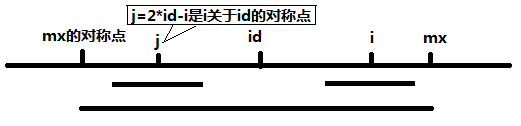
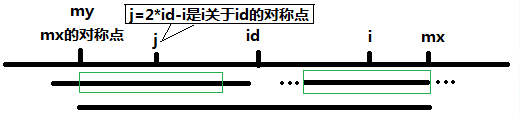

# 5-Longest Palindromic Substring

Given a string **s**, find the longest palindromic substring in **s**. You may assume that the maximum length of **s** is 1000.

**Example:**

```
Input: "babad"

Output: "bab"

Note: "aba" is also a valid answer.

```

**Example:**

```
Input: "cbbd"

Output: "bb"

```

## 题解

### 暴力，时间复杂度O(n^3)

枚举所有的子串，然后遍历判断子串是否为回文串。

### 动态规划，时间复杂度O(n^2)，空间复杂度O(n^2)

 属于对暴力解法的优化，需要O(n^2)的空间复杂度。

1. 用dp\[i\]\[j\]来打表保存子串s[i, j]是否为回文串。
2. 有状态转移方程dp\[i\]\[j\] = dp\[i+1\]\[j-1\] && s[i] == s[j]
3. 初始状态为dp\[i\]\[i] = true，以及遍历dp\[i-1]\[i\]判断其true或false（实现时可以令dp\[i]\[i-1\]=true，长度为2的子串就可以通过状态转移方程得出），即子串长度为1和2所有子串是否为回文串已经获得，接下就是枚举长度为3至n。从子串长度上枚举能保证以前的子串状态已经获得。

```c++
string longestPalindrome(string s) {
  int len = s.size();
  bool dp[len][len];
  //初始化，dp[i][i-1]=true为了方便length=2时与length>2一样
  dp[0][0] = true;
  for (int i = 1; i != len; ++i) {
    dp[i][i] = true;
    dp[i][i - 1] = true;
  }
  int index = 0;
  int longest = 1;
  for (int length = 2; length <= len; ++length) {
    for (int left = 0, right = length - 1; right != len; ++left, ++right) {
      if (s[left] == s[right] && dp[left + 1][right -1]) {
        dp[left][right] = true;
        longest = length;
        index = left;
      } else {
        dp[left][right] = false;
      }
    }
  }
  return s.substr(index, longest);
}
```

### 中心扩展法，时间复杂度O(n^2)，空间复杂度O(1)

遍历字符串的每个字符，对每个字符向两端扩展，得出最大回文串的长度。由于最大回文串可能是偶数长度或者奇数长度，故对每个字符需要进行偶数扩展（只需要以当前字符和前一个字符为中心即可）和奇数扩展。

```c++
string longestPalindrome(string s) {
  int index = 0;
  int len = 1;
  int left, right;
  for (int i = 1; i < s.size(); ++i) {
    for (left = i - 1, right = i + 1; left >= 0 && right < s.size() && s[left] == s[right]; --left, ++right) {}
    if (right - left - 1 > len) {
      len = right - left - 1;
      index = left + 1;
    }
    for (left = i - 1, right = i; left >= 0 && right < s.size() && s[left] == s[right]; --left, ++right) {}
    if (right - left - 1 > len) {
      len = right - left - 1;
      index = left + 1;
    }
  }
  return s.substr(index, len);
}
```

### Manacher算法，时间复杂度O(n)，空间复杂度O(n)

#### 字符串预处理

在每个字符前后都加入一个特殊字符，如abc处理成#a#b#c#，abcd处理成#a#b#c#d#。处理后字符串的长度是奇数。

记处理后的字符串为s，用数组p[i]来记录以s[i]为中心的最长回文串向左和向右扩展的长度（包括s[i]），那么就有**p[i]-1为原字符串中回文串的长度**。

#### 求p[]数组的方法

记id为当前已求得最长回文串的中心位置，mx为该最长回文串的的右边界（不包括），即mx = id + p[id]。


i关于j的对称点是j = 2*id - i。

当i < mx时，通过对称所带来的信息，p[i]可以通过[j]来求得，需要分两种情况：

1. 如果mx - i > p[j]时，p[i] = p[j]。

   

2. 如果mx - i < p[j]时，p[i] = mx - i。根据下图可以容易看出p[i] >= mx - i。假设p[j]大于mx - i，那么，多出mx的那部分根据i对称，再根据id对称，然后根据j对称，说明了my前边有部分和mx后边有部分相等，那么最大回文串应该更大，故和p[id]矛盾。

   

故i < mx时，p[i] = min(p[2*id - i], mx - i)。

当i > mx时，只能通过先令p[i] = 1，然后通过中心扩展去获得。

算法实现时就是靠当i > mx中心扩展得到mx，然后mx之前的所有p[i]值都直接可以得到，当i超出mx继续扩展，如此循环下去，直到字符串遍历完毕。

可以在数组的前后插入两个特殊字符（必须是原字符串中没出现，同时不是不是插在字符之间的那个字符）来方便匹配，遍历时从1至n-1遍历即可（下标0开始）。

下标转换为index  / 2，没有插入头尾元素的转换，插入头尾元素需要(index - 1) / 2。

```c++
string longestPalindrome(string s) {
  //预处理
  string str;
  str.push_back('$');
  str.push_back('#');
  for (int i = 0; i != s.size(); ++i) {
    str.push_back(s[i]);
    str.push_back('#');
  }
  str.push_back('~');
  int mx = 0;
  int id = 0;
  vector<int> p(str.size(), 0);
  for (int i = 0; i != str.size() - 1; ++i) {
    if (i < mx) {
      p[i] = mx - i < p[2 * id - i] ? mx - i : p[2 * id - i];
    } else {
      p[i] = 1;
      while (str[i + p[i]] == str[i - p[i]]) ++p[i];
    }
  }
  int index = 0;
  int len = 0;
  for (int i = 1; i != str.size(); ++i) {
    if (p[i] > len) {
      len = p[i];
      index = i;
    }
  }
  //转换成原来的下标返回，需注意，len是p[i]，刚好是下标减1
  return s.substr((index - len) / 2, len - 1);
}
```

